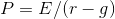

# Lesson 6 Quiz

1. **In the S&P 500 forecasting exercise, many subjects seemed to be subject to the representativeness heuristic. This concept of behavioral finance posits that:** Most people don’t behave like forecasters, what they saw in the past is representative of the future.

2. **An efficient market is defined as one in which:** Asset prices quickly and fully reflect all available information.

3. **The Dividend Discount Model (or Gordon Growth Model) can be stated as follows; let the investor’s discount rate be equal to _r_. If earnings equal dividends, and if dividends grow at the long-run rate _g_, then the price of the stock _P_ can be written as follows:** 

4. **Human judgment and experience can play a role in the advent of stock market crash because:** A lot of people who have lived through financial crises have reported that, as a consequence of these crises and their narratives, their faiths in the market have diminished.
