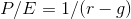

# Week 2

> In this next module, dive into some details of behavioral finance, forecasting, pricing, debt, and inflation.

## Lesson 5

- _Limited Liability_:
  - Limited Liability New York State 1811
  - Divide up an enterprise into shares, and no shareholder is liable for more than he or she put in
  - Other states were very skeptical
  - New York produced many failed corporations, a few spectacular successes
- _Inflation Indexed Debt_:
  - History shows many examples of nominal debt being wiped out in real terms by high inflation
  - Indexed debt first attempted in Massachusetts, 1780, to help finance Revolutionary War
  - Shay's rebellion 1786, sparked by apparent unfairness of other nominal contracts (e.g., soldier's pay) being worthless while indexed debt was not
  - Indexed bonds did not appear again in the United States until 1997
  - Still today no private indexed debt
- _Real Estate Risk Management Devices_:
  - Value of homes is a major source of risk
  - Casualty insurance
  - Securitized Mortgages
  - Home price futures and options 2006
  - Equity-protected mortgages

### Lesson 5 Mini Quizzes

- **The concept of "limited liability” posits that:**

  - Investors, in order to be encouraged to invest in businesses, should be protected against liability for what the managers of the business do
  - Investors in stocks cannot be pursued for the mistakes of the company they are investing in
  - A limited liability enterprise can be divided into shares, and no shareholder is liable for more than he or she puts in

- **Indexing the value of debt to an index:**

  - Is a better indexation method than indexing debt to a single commodity with a potentially unstable price evolution
  - Protects investors from currency instability

- **In economics, money is often defined in terms of the:** Three functions it provides: a store of value, a unit of account and a medium of transaction.

## Lesson 6

- _Random Walk Hypothesis_:
  - First coined by statistician Karl Pearson in the scientific journal Nature in 1905
  - Is a process that changes in such a way that each change is independent of previous changes and totally unpredictable
- _Harry Roberts, 1967_:
  - Weak form efficiency: prices incorporate information about past prices
  - Semi-strong form: incorporate all publicly available information
  - Strong form: all information, including inside information
- _Price as PDV (Present Discount Value) of Expected Dividends_:
  - If earnings equal dividends and if dividends grow at long-run rate _g_. then by growing consol model , 
  - Efficient markets theory purports to explain why P/E varies across stocks
  - Low P/E does not mean that the stock is a bargain, it only means that earnings are rationally forecasted to decrease in future
  - Efficient markets denies that any rule works

### Lesson 6 Mini Quizzes

- **Which of the following is NOT an implication of the Random walk hypothesis?** A graph of the S&P500 shows a steady rise over the past three years.

- **What does the price-to-earnings ratio (P/E) tell you?** How much investors are willing to pay per unit of a company’s earnings.

## Lesson 7

- _From Theory of Moral Sentiments, Adam Smith, 1759 to Behavioral Economics_:
  - Adam Smith: people have a desire for praise but don't enjoy being praised for something they did not do
  - As people mature, if the mature successfully, the desire for praise morphs into a desire for praiseworthiness
- _Prospect Theory_:
  - Kahneman and Tversky, _Econometrica_ 1979
  - Two elements: value function and weighting function
  - Elements replicate utility function and probabilities in expected utility theory which has dominated economic thought

### Lesson 7 Mini Quizzes

- **What was the key motivation in developing prospect theory?** Psychology experiments do not align with the assumptions of traditional economics.
