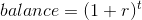
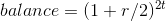
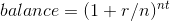
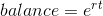
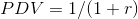
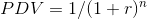
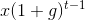
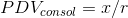
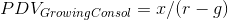
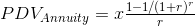

# Week 3

> Stocks, bonds, dividends, shares, market caps; what are these? Who needs them? Why? Module 3 explores these concepts, along with corporation basics and some basic financial markets history.

## Lesson 8

- _Causes of Interest Rates_:
  - _Eugen Böhm von Bawerk: Capital and Interest, 1884_: technological progress, time preferences, advantages to roundaboutness
- _Compound Interest_:
  - If annual rate is _r_, compounding once per year,  after _t_ years
  - If compounded twice per year, balance is  after _t_ years
  - If compounded _n_ times per year, balance is  after _t_ years
  - Continuous compounding, balance is 
- _Discount Bonds_:
  - No coupon payments, just principal at maturity date
  - Initially sold at a discount and prices rises through time, creating income
  - Term _T_, YTM (Yield to Maturity) _r_
- _PDV (Present Discount Value)_:
  - PDV of a dollar in one year: 
  - PDV of a dollar in _n_ years: 
- _Consol and Annuity Formulas_:
  - Consol pays constant quantity _x_ forever
  - Growing consol pays  in _t_
  - Annuity pays _x_ from time 1 to _T_
    - 
    - 
    - 
- _Leverage and its Discontents_:
  - The start of the 2008-2009 world financial crisis had to do with home buyers in US and elsewhere borrowing to buy homes
  - China today is a highly leverages economy, arousing concerns
  - Debt leads to bankruptcies, possible world crises
- _Irving Fisher - The Debt-Deflation Theory of Great Depressions, Econometrica 1933_:
  - Deflation redistributes real wealth from debtors to creditors
  - Creditors tend to be more cautious

### Lesson 8 Mini Quizzes

1. **True or False. The “term” of a contract is the maximum amount of time that may pass before you must withdraw your money.** False, the "term" is the minimum amount of time that must pass before you can withdraw your money without penalty.

2. **Why was EONIA, the European version of the Federal Funds Rate, allowed to go negative?** It is expensive for banks to store money.

3. **Select all of the statements that are true about consols and annuities:**

   - Corporations do not issue consols since they would most likely not find a demand for it: investors do not believe that corporations will never disappear
   - The main difference between an annuity and a corporate bond is that there is no principal repayment at maturity in an annuity
   - Consols are risky debt securities. Even if the issuer of a consol never defaults, hence no default risk, there is still some market risk since the price of the consol is set by the market

4. **True or False. The overall level of debt in the economy (hence leverage) rises in real value because of deflation.** True

## Lesson 9

- _The Corporation_: a body corporate legally authorized to act as a single individual, an artificial person created by royal charter, prescription, or act of legislature, and having authority to preserve certain rights in perpetual succession
- _Board of Directors_:
  - In US, Board is commonly chaired by CEO
  - But CEO is hired by the board
- _For-profit vs Non-profit_
  - For-profit corporation is owned by shareholders, equal claim after debts paid, subject to corporate profits tax
  - Non-profit is not owned, self-perpetuating directors, not subject to corporate profits tax
  - For-profit exists to benefit shareholders, non-profit does not
  - For-profit has a price per share, non-profit does not
  - Ideally, for-profit has value only because the company is dedicated to advancing the shareholder, either through dividends or through share repurchase
- _Meaning of Shares and Market Cap_:
  - Ownership of company equals shares divided by total shares
  - If company pays a dividend, the value of the share should go down by the amount of the dividend per share
- _Common vs Preferred Stock_:
  - Common stock: dividend is at discretion of firm, subject to legal restrictions
  - Preferred stock: specified dividend does not have to be paid, but firm cannot pay dividend on common stock unless all past preferred stock dividends are paid
  - Corporate bonds: firms are contractually obligated to pay coupons and there is a maturity date when principal must be paid
- _How do Corporations raise money?_
  - Company could issue new shares:
    - This _dilutes_ existing shareholders since they now own a smaller fraction of the company but offsetting that, it creates new earning power for the company
    - Shareholders at a meeting could vote on whether they think the prospective profits are worth the dilution, and prospective purchasers of the issue could ponder whether they feel the diluted shares are worth purchasing
- _Dilution_:
  - If the company gives away new shares, shares become worth less
  - If the company sells new shares at market price, that generally does not lower the value of shares because the company has the money
- _Share Repurchase_:
  - The opposite of dilution, the value of the firm should go down by the amount they spent
  - Shareholders own a larger share of the company
  - If the firm repurchases shares instead of paying dividends, then the shares do not lose value, rather the company loses value but the shareholder has a bigger share in the company
- _Price as PDV of Expected Dividends_:
  - Efficient markets theory purports to explain why _P/E_ varies across stock in terms of _r_ and _g_ (long-run rate)
  - Low _P/E_ does not mean that the stock is a bargain, rather it means that earnings are rationally forecasted to decrease in the future (low _g_) or that risk is high (high _r_)
- _Why do firms pay Dividends?_
  - Even when there was a stronger tax advantage to capital gains, firms paid dividends
  - Framing matters, dividends are often framed as income

### Lesson 9 Mini Quizzes

1. **What is the difference between a for-profit and a non-profit corporation?**
   - A for-profit corporation has a price per share, whereas a non-profit corporation is not traded in the market
   - A for-profit corporation is subject to corporate profits tax, which is not the case for a non-profit corporation
   - A for-profit corporation is owned by shareholders, whereas a non-profit corporation has self-perpetuating directors
