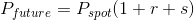

# Week 5

> Options and bond markets are explored in module 5, important components of financial markets.

## Lesson 12

- _Forward Contract_:
  - Forward is just a contract to deliver at a future date (exercise date or maturity date) at a specified exercise price
  - Example: rice farmer sells rice to warehouser
  - Both sides are locked into the contract, no liquidity
- _Future Contracts_:
  - Futures contracts differ from forward contracts in that contractors deal with an exchange rather than each other, and thus do not need to assess each others' credit
  - Futures contracts are standardized retail products, rather than custom products
  - Futures contracts rely on margin calls to guarantee performance
- _Buying or Selling Futures_:
  - When one "buys" a futures contract, one agrees with the exchange to a daily settlement procedure that is only loosely analogous to buying the commodity. One must post initial margin with the futures commission merchant
  - Usually, one has no intention of taking delivery of the commodity
  - Same as when one "sells" a futures contract, no intention of selling the commodity. Again, post margin
- _Daily Settlement_:
  - Every day, the exchange defines a price called the "settle" price, which is the last trade on that day
  - Every day until expiration a buyer's margin account is credited (or debited if negative) which the amount: change in settle price by some contract amount
  - If contract is cash settled on the last dat the margin account is credited with (cash settle price-last settle price) some contract amount
  - If contract is physical delivery, on the last day buyer must receive commodity
- _Fair Value in Futures Contract_:
  - Futures price is normally above cash price, the fair value is given by: , where _r_ is interest rate, _s_ is storage cost, and _r + s_ is cost of carry

### Lesson 12 Mini Quizzes

1. **True or False. Speculators are compared to gamblers because they risk money for entertainment.** False, speculation is more intellectual than gambling and involves distinguishing which markets are over- or under-valued.

## Lesson 13

- _Two basic kinds of Options:_
  - Calls: a right to buy
  - Put: a right to sell
- _Options_:
  - One pays money to have a choice in the future
  - Essentially, you buy the ability to exercise free will, the choice one makes depends only on the underlying asset price
  - Options are truncated claims on assets
- _Why have options?_
  - Salience and attention
  - People buy insurance, do not want to give up up-side of investment
  - Peace of mind, with put option

### Lesson 13 Mini Quizzes

1. **Which of the following correctly defines bid price, asking price, and last price?**

- "Ask" is the price to purchase an option
- "Bid" is the price to sell the option back to the dealer
- "Last" is the last price the option was sold for
