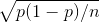

# Week 1

## Lesson 1

- Course will cover the following:
  - How we incentivize people to get things done
  - Applying psychology and sociology to finance
  - Regulating financial markets

## Lesson 2

- _VAR_ in finanace means two things, variance, and "value at risk" but when the A isn't capitalized (VaR) it means _value at risk_
  - Was invented after stock market crash of 1987
  - E.g., 1% one-year VaR of $10M means 1% chance that a portfolio will lose $10M in a year
- _Stress Tests_
  - OFHEO (Office of Federal Housing Enterprise Oversight) started testing firms' ability to withstand economic crisis before the 2008 crisis failed
  - Dodd Frank Act 2010 requires the Federal Reserve to do annual stress tests for non-bank financial institutions it supervises for at least three different economic scenarios
- _Beta_ is the regression slope coefficient when the return on the ith asset is regressed on the return on the market
  - The CAPM (Capital Asset Pricing Model) implies that the expected return on the ith asset is determined from it's beta
- Variance of the return of a stock is equal to its beta squared times the variance of the market return (systematic risk) plus the variance of the residual in the regression (idiosyncratic risk)
- _Central Limit Theorem_
  - Averages of a large number of independent identically distributed shocks are approximately normally distributed
  - Can fail if shocks are fat tailed
  - Can fail if shocks lose their independence
- Risk is determined by _covariance_ - a measurement of the directional relationship between the returns on two assets

## Lesson 3

- _Risk pooling_ is the source of all value in insurance
  - If _n_ policies, each has independent probability _p_ of a claim, then the number of claims follows the binomial distribution. The standard deviation of the fraction of policies that result in a claim is 
  - _Law of large numbers_: as _n_ gets large, standard deviation approaches zero
- Insurance principles and issues:
  - _Risk pooling_
  - _Moral hazard_ dealt with partially by deductions and co-insurance
  - _Selection bias_ dealt with by group policies, by testing and referrals, and by mandatory government insurance
- _Federal insurance office (Dodd Frank)_ monitors insurance companies, looking for systemic risk (still no national charter)
- _State Insurance Guarantee Funds_:
  - Most US states have guarantee funds protecting insurance against failure of the insurance company (New York was first to set up in 1941)
  - Protects individuals, not businesses or group insurance
- _US Government Regulation of Insurance_:
  - _MaCarran-Ferguson Act of 1945_ reduced the complexity of the insurance industry by consolidating regulation at the state level
  - NAIC (National Association of Insurance Commission) creates standardized suggest laws
  - NAIC adopts risk-based capital requirements in 1993
  - _Gramm-Leach-Biley Financial Modernization Act of 1999_ allowed banks to affiliate with insurance companies
- _Health Insurance_:
  - Proposed in 1694 by Hugh the Elder Chamberlen
  - First US health insurance: Franklin Health Assurance Company of Massachusetts, 1850
- _Health Maintenance Organization Act of 1973_:
  - Required employers with 25 or more employees to offer federally certified options
  - Designed to overcome moral hazard problem, doctors earning fees for procedures make more money if people are sick
- _US Patient Protection and Affordable Care Act 2010 (Obamacare)_:
  - Penalty for individuals not buying insurance
  - Penalty for companies not buying insurance for their employees
  - New insurance exchanges; a health insurance exchange is a set of state-regulated standardized health care plan, from which individuals may purchase health insurance that is eligible for Federal subsidies
  - Insurance companies may not disallow for preexisting conditions or drop people who get sick
